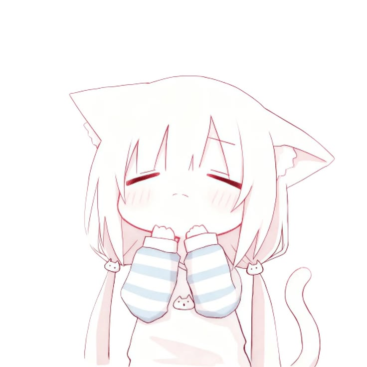
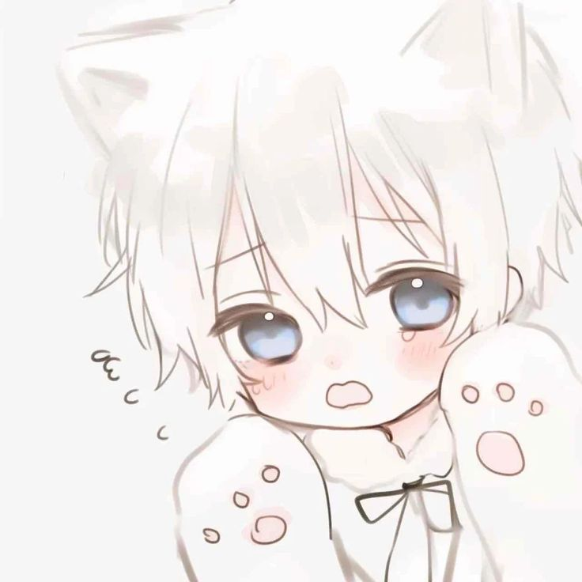

# ฅ^•ﻌ•^ฅ Hi! I'm Valeriy!

<div align="left">
  
  

🎀 **2nd year student • beginner developer • electronics student • meow~**

> just a silly cat learning how computers work :3

💻 Programming • 🔌 Electronics • 🎮 Unity
🧊 Blender • 🥽 VRChat • 🐾 Cute things

  <br clear="left">
</div>


---

### 🌱 I'm currently learning

🎮 **Unity**
🧊 **Blender**
💻 **Programming**
🔌 **Electronics & radio engineering**

I'm still a beginner at all of this, so most of my repositories are going to be little experiments, unfinished projects, and things I'm learning from. 💗

---

### 🔧 Things I want to make

🐾 **Arduino CNC plotter**
🥽 **VRChat avatars**
⚡ **Arduino / ESP32 projects**
🔌 **Electronics experiments**
💻 **Small programming projects**

---

### 🎀 My current skill tree

```text
Programming  🌱🌱░░░░░░░░
Unity        🌱🌱░░░░░░░░
Blender      🌱🌱░░░░░░░░
Electronics  🌱🌱░░░░░░░░

Meowing      ████████████ 100%
```

---

### 🐱 About me

* 🎓 2nd year college student
* 🥽 VRChat enjoyer
* 🔧 I like making and fixing things
* 💻 Learning programming from the beginning
* 🎮 Learning Unity
* 🧊 Learning Blender
* 🎀 Cute things enjoyer
* 🐾 Professional meower

---

### 💗 Currently working on

> 🔧 Learning how things work
> 💻 Writing my first projects
> 🎮 Creating things for VRChat
> ⚡ Experimenting with electronics
> 🐾 Becoming a better little developer

---

```text
╭──────────────────────────────╮
│                              │
│     ₍^. .^₎⟆  meow~          │
│                              │
│     learning • creating      │
│     breaking • fixing        │
│                              │
╰──────────────────────────────╯
```

> 💗 `meow.exe` is running...
